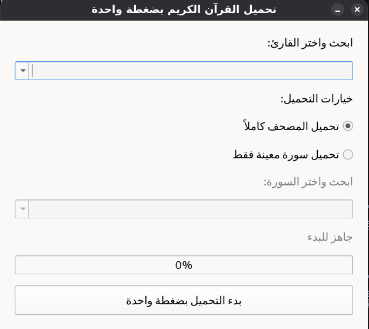

# 📖 Quran Downloader

## 📖 About

Quran Downloader is an open-source project that helps you build your own offline Quran audio library with ease.

The project includes two applications:

- 🖥️ **Desktop App (PyQt6)** — A lightweight native application for Windows and Linux that lets you download complete Mushafs or individual Surahs from over **241 reciters**, with real-time progress tracking and organized downloads.

- 📱 **Mobile App (Flutter)** — A modern Android application offering the same downloading experience with a beautiful Material 3 interface, background downloads, download management, and an optimized mobile user experience.

Whether you're using your computer or your phone, Quran Downloader makes collecting and organizing Quran recitations simple, fast, and reliable.

<p align="center">
  
  
</p>

---

## ✨ Features

### 🖥️ Desktop Application (PyQt6)

- 🎙️ **241 Built-in Reciters (Qaris)** — Includes one of the largest built-in reciter libraries, featuring globally recognized Qaris as well as many lesser-known reciters.
- 🔍 **Smart Search** — Instantly search reciters and Surahs with live autocomplete.
- 📚 **Download the Entire Mushaf** — Download all 114 Surahs with a single click.
- 🎯 **Single Surah Download** — Download only the Surah you need.
- 📊 **Real-Time Progress Tracking** — Live progress bar, current Surah, percentage, and estimated time remaining (ETA).
- ⚡ **Responsive UI** — Downloads run in the background using `QThread`, keeping the interface smooth.
- 🔁 **Resume-Friendly Downloads** — Existing files are automatically skipped.
- 🗂️ **Organized File Structure** — Files are saved as `NNN - SurahName.mp3` inside folders named after each reciter.
- 🛡️ **Error Resilience** — Failed downloads are logged while the remaining queue continues normally.
- 🖥️ **Standalone Executable** — No Python installation or additional setup required.

### 📱 Mobile Application (Flutter)

- 📱 **Modern Material 3 Interface** — Clean, responsive, and optimized for Android devices.
- 🎙️ **Browse Hundreds of Reciters** — Quickly find your favorite reciter.
- 📚 **Download Full Mushaf** — Download all Surahs with one tap.
- 🎯 **Single Surah Download** — Download individual Surahs whenever needed.
- 📊 **Background Downloads** — Continue downloading even while using other apps.
- 📂 **Download Manager** — Track download progress, status, and completed files.
- 🔍 **Fast Search** — Instantly search both reciters and Surahs.
- 📁 **Organized Storage** — Audio files are neatly grouped by reciter.
- 🎨 **Beautiful Flutter UI** — Built with Material 3 for a smooth user experience.
- ⚡ **Optimized Performance** — Lightweight architecture with responsive interactions.

---

## 🖼️ How It Works

### 🖥️ Desktop Application

1. Search and select a **reciter** from the searchable dropdown.
2. Choose a download mode:
   - 📚 Download the entire Mushaf (114 Surahs), or
   - 🎯 Download a specific Surah.
3. If downloading a single Surah, select it from the searchable Surah list.
4. Click **Start One-Click Download**.
5. Monitor the live progress bar, download status, and ETA.
6. Once completed, the downloaded files are automatically organized inside your Downloads folder.

Downloaded files are stored in:

```text
~/Downloads/Quran_Downloads/<Reciter_Name>/

---

## 🚀 Usage

### 🖥️ Desktop Application

No installation or setup required.

1. Download the latest **Windows (.exe)** or **Linux (AppImage)** release from the [Releases](../../releases) page.
2. Double-click the executable (or launch the AppImage on Linux).
3. Select a reciter, choose your download mode, and start downloading.

### 📱 Mobile Application

1. Download the latest **Android APK** from the [Releases](../../releases) page.
2. Install the APK on your Android device.
3. Launch the app.
4. Browse or search for a reciter.
5. Download the entire Mushaf or a single Surah with one tap.

---

## 📁 Project Structure

```text
Quran-Installer/
│
├── desktop/
│   ├── quran_downloader_gui.py      # Desktop application source (PyQt6)
│   ├── clean_root_reciters.json     # Reciters database
│   ├── surah.json                   # Surah metadata
│   ├── Screenshot.png               # Desktop preview
│   └── ...
│
├── mobile/
│   ├── lib/                         # Flutter application source
│   ├── assets/                      # Images, icons and resources
│   ├── android/                     # Android platform files
│   ├── ios/                         # iOS platform files
│   ├── pubspec.yaml                 # Flutter dependencies
│   └── README.md                    # Mobile documentation
│
├── README.md                        # Main repository documentation
└── LICENSE
```

### 🖥️ Desktop Application

The desktop application is built with **Python + PyQt6** and keeps the implementation simple and lightweight.

Main components include:

- **`quran_downloader_gui.py`** — Main application window and download logic.
- **`DownloadWorker`** — Background `QThread` responsible for downloading files without freezing the UI.
- **`RECITERS`** — Database containing **241 Quran reciters** and their audio sources.
- **`SURAHS`** — Complete list of all 114 Surahs used throughout the application.

### 📱 Mobile Application

The mobile application is built with **Flutter** using a scalable architecture.

Key folders include:

- **`lib/`** — Application source code.
- **`assets/`** — Images, icons, fonts and other resources.
- **`android/` & `ios/`** — Platform-specific configurations.
- **`pubspec.yaml`** — Flutter packages and project configuration.

For more details about the Flutter application, see:

➡️ **[`mobile/README.md`](mobile/README.md)**
---

## ⚠️ Notes

- 📡 An internet connection is required to download Quran recitations.
- 🎧 Audio files are fetched from publicly available Quran audio servers, so availability depends on those services.
- 📂 Downloaded recitations are organized automatically by reciter name.
- 🖥️ The Desktop application is distributed as a standalone executable and does not require Python or additional dependencies.
- 📱 The Mobile application requires Flutter only if you intend to build or modify the source code.
- 🤲 This project is completely free and open source, created to make downloading Quran recitations simple and accessible for everyone.

---

## 🤝 Contributing

Contributions are always welcome!

Whether you'd like to:

- 🐛 Report a bug
- 💡 Suggest a new feature
- 🚀 Improve performance
- 🎨 Enhance the UI/UX
- 📖 Improve the documentation

Feel free to open an **Issue** or submit a **Pull Request**.

Every contribution helps make Quran Downloader better for everyone. ❤️


